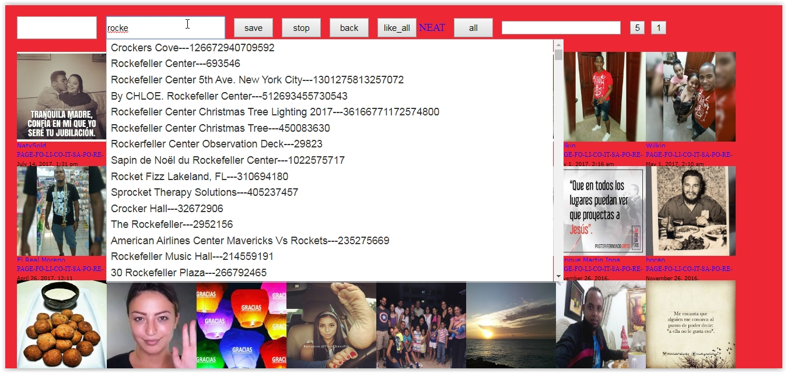
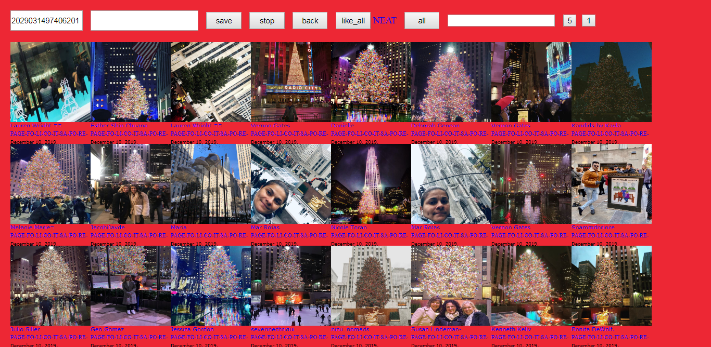
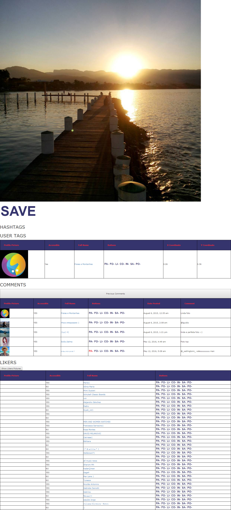

# Instagram API

This is tied in my top 2 favorite applications which I made! I use this all the time.

For important reasons, I'm not giving out the code for this except for the Instagram Authentication code which was truly difficult. If you are an employer and you would love to see the code I did the sites below, please contact me at opaline222@gmail.com or on GitHub or on any of my social media accounts.

This offers a much augmented better Instagram experience that is custom to my needs. It can search hashtags & locations, and it offers one-click AJAX functionality for Liking/Following/Inboxing/Saving other users, with an animated fading notification for "Success/Fail" below resembling Facebook's notifications (Red for fail, Green for success)

There are more features, just look on below.

# Authentication

I had many ways of persisting the session instead of logging into Instagram in every single Instagram API Call. Since PHP closures do not serialize, I had to change the session object once it's created just to successfully serialize the session object to eliminate continual login calls. You could check it out in instagram_authentication

# Hashtag


# Location

Anytime a user accesses a new picture through a hashtag/location search, it saves a location as an entry in an SQLite Database. But it leverages SQL to determine if it is already in there and will not add if it is.

```php
if(isset($location_id) && $_GET['save'])
	{
		$file_db = new PDO('sqlite:location.sqlite3');
		$exec_query = "INSERT INTO locations (location_id,location) SELECT '{$location_id}', '{$location_name}' WHERE NOT EXISTS (SELECT 1 FROM locations WHERE location_id = '{$location_id}' AND location = '{$location_name}')";
		$exec = $file_db->exec($exec_query);
	}
```

There is an autocomplete in one of the fields to choose a city or location to do this search, instead of searching online for the Location ID.




# User 

On the right hand column of the User Page are all the tagged users, which will automatically show up (done in JavaScript Ajax Success calls). It allows doing the Instagram one-click actions faster.


# Media

